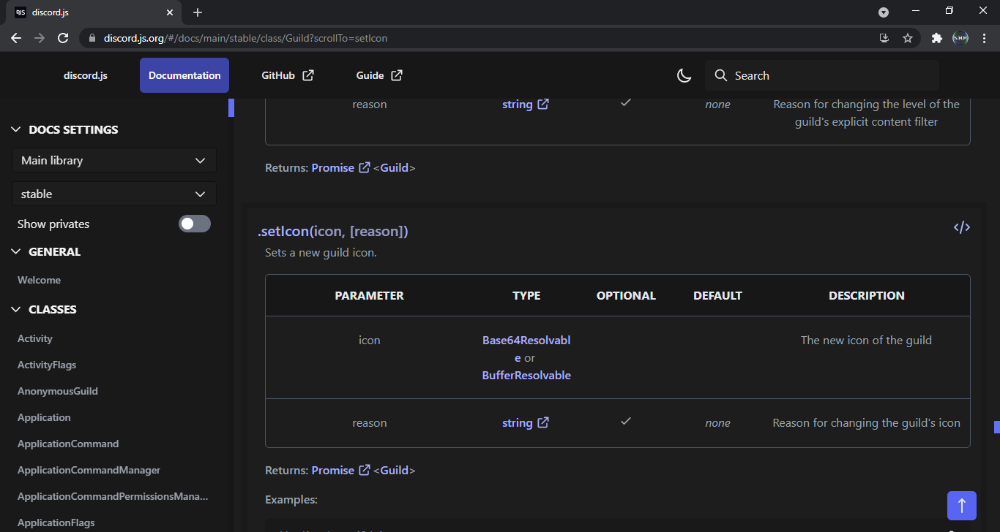
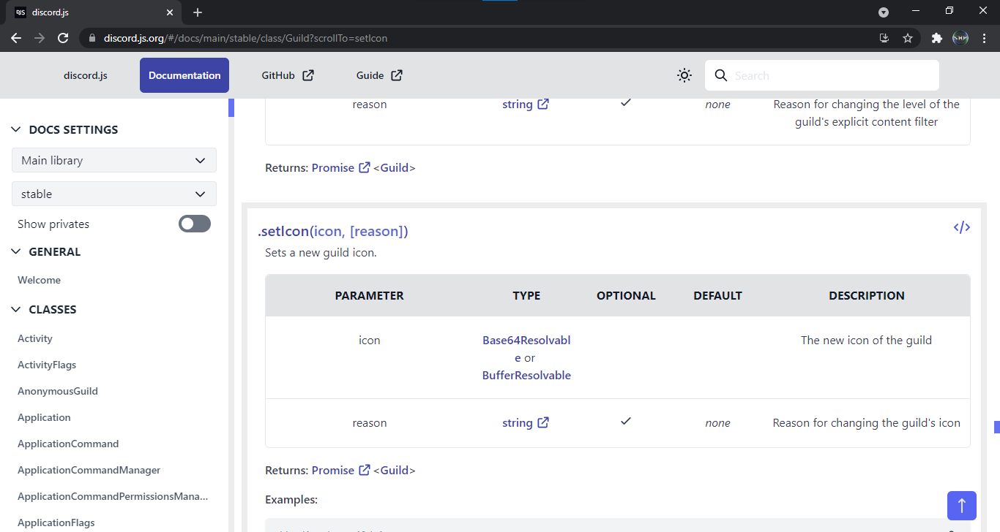

# discord.js.org-Prettier
A slightly better version of discord.js' website tailored to myself.

## Features
- [x] Checkbox background colour now inherits background colour when unchecked
- [x] Chrome's scrollbars are dark on dark theme (small width)
- [x] Darker codeblock background on dark theme
- [x] Member separator is no more
- [x] Slightly less padding
- [x] Subtle member outlines

## Preview

*Screenshot: Dark*
  

*Screenshot: Light*